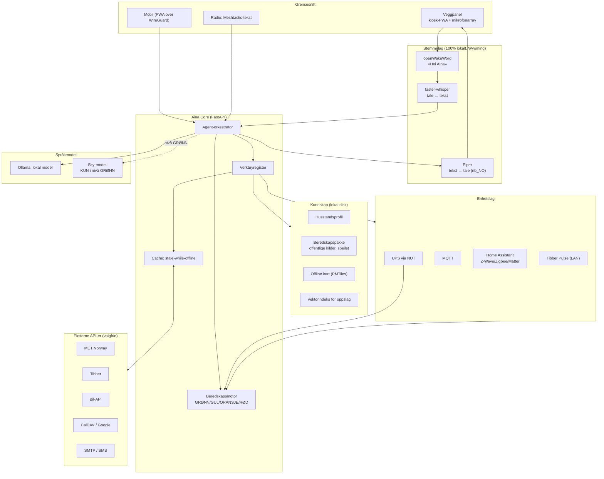

# 02 — Arkitektur

## Grunnprinsipp: skyen er en cache, ikke en avhengighet

Vanlig assistent: enhet → sky → svar. Mister du skyen, mister du produktet.

Aina: enhet → **lokal kjerne** → svar. Lokal kjerne bruker skyen *når den finnes*
til å friske opp data og til å låne en større modell. Datastrømmen går alltid
gjennom lokal lagring, aldri utenom.

Praktisk konsekvens: **hver konnektor må implementere `hent_ferskt()` og
`hent_lagret()`.** En konnektor uten offline-vei blir avvist i kodegjennomgang.

## Lagdeling



## Beredskapsnivåene

Dette er den viktigste mekanismen i systemet. I stedet for at ting «feiler», flytter
Aina seg mellom fire definerte nivåer. Hvert nivå har et **effektbudsjett**, et sett
**tillatte tjenester** og en **svarpolicy**.

| Nivå | Utløses av | Effektmål | Modell | Hva slås av | Hva Aina sier |
|---|---|---|---|---|---|
| **GRØNN** 0 | Alt normalt | Ubegrenset | Sky tillatt | Ingenting | Normale svar |
| **GUL** 1 | Internett borte > 60 s, LAN og strøm OK | Ubegrenset | Kun lokal | Sky-kall, ikke-kritisk sync | Merker alle data med alder: «varselet er fra 06:15 i dag» |
| **ORANSJE** 2 | Nettstrøm borte, på batteri | ~25 W | Lokal, liten modell | Panel dimmes, video, indeksering, GPU, ikke-kritiske containere | Melder anslått gjenstående driftstid |
| **RØD** 3 | Batteri under terskel, eller > 24 t uten strøm | ~8 W | **Ingen LLM** | Alt unntatt oppslag, kart, radiomottak, Meshtastic | Kun statiske, forhåndsskrevne sjekklister og kartdata |

Nivået går **umiddelbart opp** ved forverring, men **med forsinkelse ned** igjen
(standard 5 minutter), slik at et flakkende nett ikke får systemet til å hoppe.
Implementert i [`aina/readiness.py`](../services/aina-core/aina/readiness.py).

Den viktigste designbeslutningen her: **i RØD finnes det ingen språkmodell.**
Når batteriet er kritisk skal familien få forhåndsskrevet, verifisert tekst — ikke
generert tekst. Det er både strømsparing og sikkerhet.

## Datakontrakt per kilde

Hver konnektor deklarerer:

```python
Freshness(
    ttl=timedelta(hours=1),          # når vi prøver å hente på nytt
    stale_ok=timedelta(hours=12),    # brukes offline, men merkes som gammelt
    max_useful=timedelta(days=9),    # etter dette: si «vet ikke», ikke gjett
)
```

Alle svar til bruker bærer med seg `hentet_kl` og `er_gammelt`. Aina har lov til å
si «jeg vet ikke». Den har ikke lov til å presentere et fire dager gammelt værvarsel
som dagens.

## Hvorfor Home Assistant i bunn

Vi bygger **ikke** eget enhetslag. Home Assistant har allerede Z-Wave, Zigbee,
Matter, varmepumper, ladebokser, Tibber og tusenvis av integrasjoner — alt lokalt.
Å konkurrere med det ville brukt hele prosjektets budsjett på løst problem.

Arbeidsdelingen:

- **Home Assistant** = muskler. Enheter, tilstand, automasjoner, historikk.
- **Aina Core** = hode. Intensjon, beredskapsnivå, kunnskap, samtale, beslutning.

Aina snakker med HA over lokalt REST/WebSocket-API. Faller Aina ut, fungerer huset
fortsatt. Det er en bevisst feilsikring. Se [adr/0002](adr/0002-home-assistant-som-enhetslag.md).

## Prosesser (docker-compose)

| Tjeneste | Rolle | Kjører i RØD? |
|---|---|---|
| `aina-core` | Kjerne-API, beredskapsmotor | Ja (redusert) |
| `homeassistant` | Enhetslag | Ja |
| `mosquitto` | MQTT-buss | Ja |
| `postgres` | Husstandsdata, hendelseslogg | Ja |
| `radicale` | Lokal CalDAV | Ja |
| `whisper` | Tale → tekst | Nei |
| `piper` | Tekst → tale | Nei |
| `openwakeword` | Vekkeord | Nei |
| `ollama` | Språkmodell | Nei |
| `caddy` | TLS mot panel | Ja |

`deploy/docker-compose.yml` definerer alt. Nivåbytte stopper og starter tjenester
via profiler.
