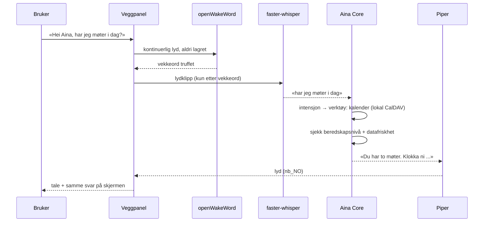

# 06 — Stemme og veggpanel

Målet: «Hei Aina, hva slags vær er det meldt i dag?» skal fungere **uten at et
eneste lydklipp forlater huset** — også når internett er nede.

Det er fullt mulig i dag. Hele kjeden finnes som fri programvare med norske
modeller.

## Talekjeden



| Ledd | Komponent | Nøkkel | Merknad |
|---|---|---|---|
| Vekkeord | **openWakeWord** | Nei | «Hei Aina» må trenes som egen modell — noen hundre lydeksempler, én ettermiddags arbeid |
| Tale → tekst | **faster-whisper** | Nei | `small` eller `medium` gir god norsk. Kjører på CPU på en N100 med noen sekunders latens; GPU gir sanntid |
| Tekst → tale | **Piper** | Nei | Norske bokmålsstemmer finnes. Svært lett — kjører fint selv i ORANSJE |
| Transport | **Wyoming-protokollen** | Nei | Samme protokoll Home Assistant bruker, så panel og HA kan dele stemmelag |

Ingen av leddene krever nøkkel eller nett. Det er hele poenget.

**Personvern i lydlaget, konkret:**
- Lyd bufres i minne, aldri på disk, aldri lenger enn vinduet vekkeordet trenger.
- Opptak starter først **etter** vekkeord.
- Fysisk mikrofonbryter på panelet. Om den er av skal det synes på skjermen.
- Synlig indikator når mikrofonen lytter. Ingen skjult lytting, noensinne.

## Panelet

En kiosk-PWA, servert lokalt, alltid på, aldri avhengig av nett.

**Skjermbildet i normal drift** — det familien ser i forbifarten:

```
┌──────────────────────────────────────────────┐
│  torsdag 11. juni          ●  ALT NORMALT    │
│                                              │
│    7°  lett regn                             │
│    ↑ 12°  ↓ 4°   vind 6 m/s NV               │
│                                              │
│  I DAG                     STRØM             │
│  09:00 Tannlege            0,94 kr/kWh       │
│  14:30 Fotballtrening      billigst 02–05    │
│                            Bil: 78 %         │
│                                              │
│  🎤  Si «Hei Aina»                           │
└──────────────────────────────────────────────┘
```

**Samme panel i nivå ORANSJE** — layoutet bytter helt, ikke bare farge:

```
┌──────────────────────────────────────────────┐
│  ⚠  STRØMBRUDD     batteri 71 %  ~34 t igjen │
│                                              │
│  Nett: nede siden 04:12                      │
│  Varsel (fra 03:00, 5 t gammelt):            │
│    Oransje farevarsel, sterk vind til 22:00  │
│                                              │
│  ▸ Nærmeste tilfluktsrom: 1,2 km ↗           │
│  ▸ Sjekkliste strømbrudd                     │
│  ▸ Send melding på Meshtastic                │
│                                              │
│  Familien: Tommy hjemme · Aina hjemme         │
│            2 barn — sist sett 21:40          │
└──────────────────────────────────────────────┘
```

Designregler for panelet:

1. **Lesbart på tre meters avstand.** Dette er et informasjonspanel, ikke en app.
2. **Ingen scrolling i beredskapsnivå.** Alt som betyr noe skal få plass.
3. **Aldri skjule datas alder.** «5 t gammelt» står ved siden av varselet, ikke
   i en tooltip.
4. **Ingen spinnere.** Er data gamle, vis de gamle dataene med tidsstempel.
   Aldri en tom skjerm som venter på et nett som ikke kommer.
5. **Dimmes automatisk.** Skjermen er en av de største strømpostene.
6. **Berøring skal fungere uten stemme.** Stemme kan feile, hender feiler ikke.

## Hva Aina skal kunne gjøre i hverdagen

| Område | Handlinger | Avhengigheter |
|---|---|---|
| Vær | varsel, farevarsler, nedbør neste time | MET — offline: siste varsel |
| Kalender | les, opprett, flytt, minn på | CalDAV lokalt — **virker offline** |
| Meldinger | e-post, SMS, Meshtastic | Nett/SMS — **køes offline og sendes ved gjenoppkobling** |
| Strøm | pris nå og i morgen, billigste ladevindu, forbruk | Tibber/HAN — Pulse virker offline |
| Bil | ladenivå, rekkevidde, forvarming, start lading | Bil-API — kun online |
| Hus | lys, varme, dører, sensorer, «god natt»-rutine | Home Assistant — **virker offline** |
| Husholdning | handleliste, lager, ved/vann/medisin med varsling | Lokalt — **virker offline** |
| Beredskap | tilfluktsrom, ruter, sjekklister, familiestatus | Lokalt — **virker offline** |
| Restaurantbord | skriver forespørselen, du sender | Se docs/03 § D |

Legg merke til mønsteret: **det meste av det som betyr noe virker offline.**
Det er ikke tilfeldig, det er utvalgskriteriet.

## Handlinger som endrer verden

Aina får skrive-tilgang, men innenfor regler:

- **Fritt:** lys, varme, påminnelser, handleliste, lese hva som helst.
- **Bekreftelse først:** sende melding til andre, opprette møte med gjester,
  starte billading, låse opp.
- **Aldri automatisk:** noe som koster penger, noe som ikke kan angres, noe som
  involverer nødetater.
- **Alt logges** lokalt med hvem som ba om det, hva som ble gjort, og resultat.

Denne inndelingen ligger i verktøyregisteret som `krever_bekreftelse` per verktøy,
ikke som spredte if-setninger.
